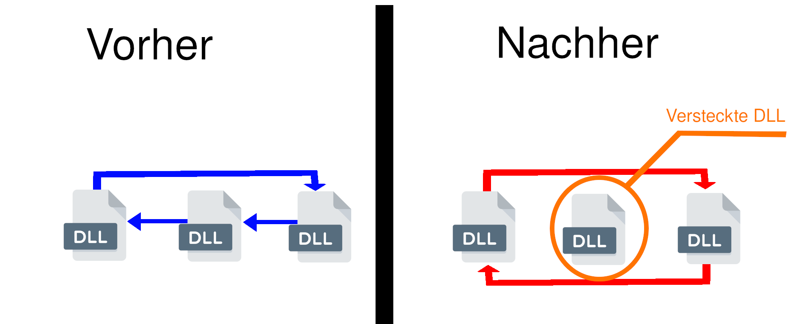
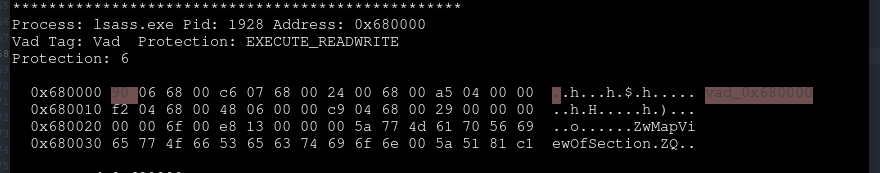

## Was ist *Memory Forensik*?

*"Memory Forensik" (Arbeitsspeicheruntersuchung)* beschreibt die __Sicherung__ des Arbeitsspeichers in Form eines Abbildes und das __Untersuchen__ des Abbildes auf ein mögliches Sicherheitsvorfalls.
Bei all den Vorteilen die eine Arbeitsspeicheruntersuchung gegenüber der traditionellen Untersuchung von persistentem Speicher bietet, ist es keine Überraschung, dass es heutzutage zu den ersten Schritten bei einem Sicherheitsvorfall zählt.
Einige wichtige Punkte die für die Arbeitsspeicheruntersuchung sprechen:



## Warnung

Beim herunterladen so wie auch beim untersuchen einer infizierten Dumb, könnten sie ihr eigenes System infizieren.
Daher wird eine virtuelle Umgebung empfohlen und diese sollte nicht im Zusammenhang mit privaten Daten stehen.
Untersuchen sie infizierte Dumbs nie in einer sensiblen Netzwerkumgebung, wie z.B bei der Arbeit oder in der Schule.
Solche Untersuchungen müssen genehmigt werden und sollten unter einhaltung aller Sicherheitsmassnahmen durchgeführt werden.
Bitte respektieren sie die Privatsphäre so wie auch das Sicherheitsbedürfnis von anderen.

## Vorbereitungen





## Mit der Untersuchung beginnen

Nun da alle Vorbereitungen abgeschlossen wurden und auch schon ein Abbild zur Untersuchung bereit steht, können wir mit dieser Anfangen.
Da wir die ganze Zeit über aus dem gleichen Abbild lesen, ist es bequemer Rekall gleich interaktiv mit geladenem Abbild zu starten:


### Prozessliste einsehen

Um überhaupt eine Vorstellung der Lage zu bekommen, beginnen wir mit der Einsicht in die Prozessliste.
Mit dem Befehl __pstree__ können alle Prozesse angezeigt werden, die zur Laufzeit, als das Abbild erstellt wurde, aktiv waren.


| _EPROCESS | ppid | thd_count | hnd_count | create_time |
|-------|--------|---------|---------|---------|
|0x823c8830 System (4)|0|59|403|-|
|. 0x820df020 smss.exe (376)|4|3|19|2010-10-29 17:08:53Z|
|.. 0x821a2da0 csrss.exe (600)|376|11|395|2010-10-29 17:08:54Z|
|.. 0x81da5650 winlogon.exe (624)|376|19|570|2010-10-29 17:08:54Z|
|... 0x82073020 services.exe (668)|624|21|431|2010-10-29 17:08:54Z|
|.... 0x8205ada0 alg.exe (188)|668|6|107|2010-10-29 17:09:09Z|
|.... 0x82279998 imapi.exe (756)|668|4|116|2010-10-29 17:11:54Z|
|.... 0x823315d8 vmacthlp.exe (844)|668|1|25|2010-10-29 17:08:55Z|
|.... 0x81db8da0 svchost.exe (856)|668|17|193|2010-10-29 17:08:55Z|
|..... 0x81fa5390 wmiprvse.exe (1872)|856|5|134|2011-06-03 04:25:58Z|
|.... 0x81c498c8 lsass.exe (868)|668|2|23|2011-06-03 04:26:55Z|
|.... 0x81e61da0 svchost.exe (940)|668|13|312|2010-10-29 17:08:55Z|
|.... 0x822843e8 svchost.exe (1032)|668|61|1169|2010-10-29 17:08:55Z|
|..... 0x822b9a10 wuauclt.exe (976)|1032|3|133|2010-10-29 17:12:03Z|
|..... 0x820ecc10 wscntfy.exe (2040)|1032|1|28|2010-10-29 17:11:49Z|
|.... 0x81e18b28 svchost.exe (1080)|668|5|80|2010-10-29 17:08:55Z|
|.... 0x81ff7020 svchost.exe (1200)|668|14|197|2010-10-29 17:08:55Z|
|.... 0x81fee8b0 spoolsv.exe (1412)|668|10|118|2010-10-29 17:08:56Z|
|.... 0x81e0eda0 jqs.exe (1580)|668|5|148|2010-10-29 17:09:05Z|
|.... 0x81fe52d0 vmtoolsd.exe (1664)|668|5|284|2010-10-29 17:09:05Z|
|..... 0x81c0cda0 cmd.exe (968)|1664|0|-|2011-06-03 04:31:35Z|
|...... 0x81f14938 ipconfig.exe (304)|968|0|-|2011-06-03 04:31:35Z|
|.... 0x821a0568 VMUpgradeHelper (1816)|668|3|96|2010-10-29 17:09:08Z|
|.... 0x81c47c00 lsass.exe (1928)|668|4|65|2011-06-03 04:26:55Z|
|... 0x81e70020 lsass.exe (680)|624|19|342|2010-10-29 17:08:54Z|
|  0x820ec7e8 explorer.exe (1196)|1728|16|582|2010-10-29 17:11:49Z|
|. 0x81e86978 TSVNCache.exe (324)|1196|7|54|2010-10-29 17:11:49Z|
|. 0x81c543a0 Procmon.exe (660)|1196|13|189|2011-06-03 04:25:56Z|
|. 0x81e6b660 VMwareUser.exe (1356)|1196|9|251|2010-10-29 17:11:50Z|
|. 0x8210d478 jusched.exe (1712)|1196|1|26|2010-10-29 17:11:50Z|
|. 0x81fc5da0 VMwareTray.exe (1912)|1196|1|50|2010-10-29 17:11:50Z|

### Verdächtige Prozesse

Um aus der pstree Ausgabe vernünftig Indizien zu sammeln, benötigt man Erfahrung und Wissen über die Betriebssysteme die man untersucht. Was hier schon für viele erfahrene XP nutzer ins Auge sticht: "lsass.exe" kommt 3x vor obwohl dieser Prozess eigentlich nur einmal vorkommen sollte.
Diese Beobachtung zu grunde liegend, nehmen wir die Prozesse 680, 868 und 1928 genauer unter die Lupe.
Zurzeit sind alle 3 Prozesse gleichviel verdächtigt.

#### WindowsXP Standardprozesse

Hier könnte es hilfreich sein das Gedächnis aufzufrischen oder für welche die nie grossartig an einem XP Rechner gesessen haben, sich eine Liste von den Standartprozessen zur seite zu legen.
Von der Uni-Regensburg, ist online eine dokumentierte Liste über die Standardprozesse von WinXP zu finden.


### Optionen evaluieren

Unter den 3 verdächtigen Prozessen, befinden sich 2 mögliche Schädlinge und einer, der wohl das Vorbild der Verschleierungsversuche ist, der eine valide Windows Standardprozess darstellt.
Doch wie wollen wir das nun herausfinde? Um den 2 gefälschten Prozessen auf die Spur zu kommen, haben wir ein breites Spektrum an Ansätzen und Möglichkeiten.
Auch hier, um einen Anhaltspunkt für das weitere Vorgehen zu finden, brauchen wir mehr Informationen.
Eine einfache __Google-Suche__ mit den Worten "lsass.exe windows xp" könnte uns interessante Informationen aufzeigen.


Daraus können wir folgende Fakten ziehen:
* lsass.exe liegt im Ordner "C:\Windows\System32"
* lsass.exe steht auf SYSTEM level und hat somit sehr hohe Rechte
* lsass.exe ist ein lokaler Sicherheit-Authentifizierungsserver Funktionen die bei einem Trojaner typisch sind (Kontrolle von Fenstern oder das Bewegen der Maus, oder Tastaturschläge) gehören nicht zu seinen Funktionsliste

### Rechtestufen

Da der valide Prozess "lsass.exe" SYSTEM-Rechte besitzt, müsste der valide Prozess grösser-gleich __(>=)__ Rechte zu den 2 Prozessen haben. Wenn wir Glück haben, sollte bei dieser Untersuchung ein Prozess höhere Rechte haben als die beiden anderen. So wissen wir welcher der valide Prozess ist.
Mittels Rekall lassen sich die Rechte der einzelnen Prozesse aufzeigen:


|Process|Sid|Comment|
|-------|---|-------|
|0x81e70020 lsass.exe|680 S-1-5-18|Local System|
|0x81e70020 lsass.exe|680 S-1-5-32-544|Administrators|
|0x81e70020 lsass.exe|680 S-1-1-0|Everyone|
|0x81e70020 lsass.exe|680 S-1-5-11|Authenticated Users|
|0x81c498c8 lsass.exe|868 S-1-5-18|Local System|
|0x81c498c8 lsass.exe|868 S-1-5-32-544|Administrators|
|0x81c498c8 lsass.exe|868 S-1-1-0|Everyone|
|0x81c498c8 lsass.exe|868 S-1-5-11|Authenticated Users|
|0x81c47c00 lsass.exe|1928 S-1-5-18|Local System|
|0x81c47c00 lsass.exe|1928 S-1-5-32-544|Administrators|
|0x81c47c00 lsass.exe|1928 S-1-1-0|Everyone|
|0x81c47c00 lsass.exe|1928 S-1-5-11|Authenticated Users|

An dieser Ausgabe ist zu erkennen, dass alle 3 Verdächtigen die gleiche Berechtigung besitzen.
Somit konnte kein valider Prozess herauskristallisiert werden.
Es gibt noch die Möglichkeit um die Priorität zu überprüfen. Denn der legitime Prozess sollte dank seinem SYSTEM-Level auch entsprechend höhere Priorität besitzen. Tatsächlich besitzen bei Windows "normale" Anwendungen max. ein Prioritätlevel von 8, wohingegen SYSTEM-Anwendungen ein Level von 9 besitzen.


Wie bei einer SQL Abfrage wird mit __SELECT__ bestimmt welche Spalten angefragt werden. In unserem Fall __name__, __die ID__ und die __Prioritätlevel__. Mit __FROM__ wird die Informationsquelle bestimmt, in dem Fall die Werte von pslist().
pslist() ist ähnlich dem pstree().
Weiter wird die Ausgabe von pslist() durch __WHERE__ gefiltert, nur Daten die als name "lsass.exe" tragen werden berücksichtigt.

|pid|name|BasePriority|
|---|----|------------|
|680|lsass.exe|9|
|868|lsass.exe|8|
|1928|lsass.exe|8|

Durch diese Ausgabe, sehen wir dass die Priorität von Prozess 680 höher liegt, als die der anderen beiden.
Wir können bereits jetzt davon reden, dass es sich beim Prozess 680 um das valide lsass.exe handelt.
Dafür sprechen 2 Punkte:
* Das erstelldatum dass ein Jahr vor den anderen 2 Prozessen liegt und mit anderen legitimen SYSTEM-Prozessen gleich ligt.
* Die höhere Priorität die durch den SYSTEM-Level kommt.

Es liegt nun auf der Hand welches der 3 Prozesse valid ist und welche 2 verdächtigt werden Schadcode zu beinhalten.
Dennoch können wir weiter die Prozesse untersuchen. Evtl können wir so den Handlungsradius bestimmen.
Wichtig für die Handlungsmöglichkeiten eines Prozesses, sind die Funktionen die es verwendet/besitzt.
Viele Funktionen finden sich in DLL-Dateien. Das sind ganze Bibliotheken von Funktionen.
Auch die Framework-Funktionen die Windowseigene Alogrithmen beinhalten, stellen diese über DLLs bereit.
Daher ist es für einen Forensiker interessant zu wissen auf welche DLLs ein Prozess zugreift, dadurch lässt sich der Handlungsspielraum eingrenzen.

### Dll Anbindung

lsass.exe pid: 680
Command line : C:\WINDOWS\system32\lsass.exe
Service Pack 3

|base|size|reason|dll_path|
|----|----|------|--------|
|0x1000000|0x6000|65535|C:\WINDOWS\system32\lsass.exe|
|0x7c900000|0xaf000|65535|C:\WINDOWS\system32\ntdll.dll|
|0x7c800000|0xf6000|65535|C:\WINDOWS\system32\kernel32.dll|

+54 weitere...

lsass.exe pid: 868
Command line : "C:\WINDOWS\\system32\\lsass.exe"
Service Pack 3

|base|size|reason|dll_path|
|----|----|------|--------|
|0x1000000|0x6000|65535|C:\WINDOWS\system32\lsass.exe|
|0x7c900000|0xaf000|65535|C:\WINDOWS\system32\ntdll.dll|
|0x7c800000|0xf6000|65535|C:\WINDOWS\system32\kernel32.dll|
|0x77dd0000|0x9b000|65535|C:\WINDOWS\system32\ADVAPI32.dll|
|0x77e70000|0x92000|65535|C:\WINDOWS\system32\RPCRT4.dll|
|0x77fe0000|0x11000|65535|C:\WINDOWS\system32\Secur32.dll|
|0x7e410000|0x91000|65535|C:\WINDOWS\system32\USER32.dll|
|0x77f10000|0x49000|65535|C:\WINDOWS\system32\GDI32.dll|

lsass.exe pid: 1928
Command line : "C:\WINDOWS\\system32\\lsass.exe"
Service Pack 3

|base|size|reason|dll_path|
|----|----|------|--------|
|0x1000000|0x6000|65535|C:\WINDOWS\system32\lsass.exe|
|0x7c900000|0xaf000|65535|C:\WINDOWS\system32\ntdll.dll|
|0x7c800000|0xf6000|65535|C:\WINDOWS\system32\kernel32.dll|
|0x77dd0000|0x9b000|65535|C:\WINDOWS\system32\ADVAPI32.dll|
|0x77e70000|0x92000|65535|C:\WINDOWS\system32\RPCRT4.dll|
|0x77fe0000|0x11000|65535|C:\WINDOWS\system32\Secur32.dll|
|0x7e410000|0x91000|65535|C:\WINDOWS\system32\USER32.dll|

+21 weitere...

Der legitime Prozess hat viel mehr DLLs eingebunden als die 2 ilegitimen Prozesse.
Das überrascht nicht, da ein Programmierer von Schadcode, zwar Funktionen von der Framework benötigt, aber nicht alle.
Wozu den Schadcode unnötig aufblähen?
Natürlich ist das nur eine Interpretation und kann höchstens als Indiz und nicht als Beweis gewertet werden.
Was wir wissen müssen, DLL-Anbindungen können absichtlich verschleiert werden.
Ein Weg dies zu tun ist das unlinken von DLLs aus der PEB. 

Mit "ldrmodules" untersuchen wir die ldr Einträge, dabei handelt es sich um eingetragene Pointer die Informationen über geladene DLLs beinhalten. Dort wird in der Antiforensik angesetzt um DLLs vor einer Untersuchung zu verstecken.



__0x81e70020 lsass.exe   680__

|base|in_load|in_init|in_mem|mapped|
|----|-------|-------|------|------|
|0x1000000|*True*|__False__|*True*|\WINDOWS\system32\lsass.exe|
|0x7c900000|*True*|*True*|*True*|\WINDOWS\system32\ntdll.dll|
|0x77be0000|*True*|*True*|*True*|\WINDOWS\system32\msacm32.dll|
|0x76b40000|*True*|*True*|*True*|\WINDOWS\system32\winmm.dll|
|0x4d200000|*True*|*True*|*True*|\WINDOWS\system32\msprivs.dll|
|0x76f60000|*True*|*True*|*True*|\WINDOWS\system32\wldap32.dll|
|0x77c00000|*True*|*True*|*True*|\WINDOWS\system32\version.dll|
|0x5ad70000|*True*|*True*|*True*|\WINDOWS\system32\uxtheme.dll|
|0x74380000|*True*|*True*|*True*|\WINDOWS\system32\wdigest.dll|
|0x774e0000|*True*|*True*|*True*|\WINDOWS\system32\ole32.dll|
|0x75d90000|*True*|*True*|*True*|\WINDOWS\system32\oakley.dll|
|0x743a0000|*True*|*True*|*True*|\WINDOWS\system32\pstorsvc.dll|
|0x743c0000|*True*|*True*|*True*|\WINDOWS\system32\psbase.dll|
|0x77dd0000|*True*|*True*|*True*|\WINDOWS\system32\advapi32.dll|
|0x77a80000|*True*|*True*|*True*|\WINDOWS\system32\crypt32.dll|
|0x743e0000|*True*|*True*|*True*|\WINDOWS\system32\ipsecsvc.dll|
|0x68000000|*True*|*True*|*True*|\WINDOWS\system32\rsaenh.dll|
|0x74440000|*True*|*True*|*True*|\WINDOWS\system32\samsrv.dll|
|0x71a50000|*True*|*True*|*True*|\WINDOWS\system32\mswsock.dll|
|0x5b860000|*True*|*True*|*True*|\WINDOWS\system32\netapi32.dll|
|0x767f0000|*True*|*True*|*True*|\WINDOWS\system32\schannel.dll|
|0x6f880000|*True*|*True*|*True*|\WINDOWS\AppPatch\AcGenral.dll|
|0x71a90000|*True*|*True*|*True*|\WINDOWS\system32\wshtcpip.dll|
|0x71ab0000|*True*|*True*|*True*|\WINDOWS\system32\ws2_32.dll|
|0x74370000|*True*|*True*|*True*|\WINDOWS\system32\winipsec.dll|
|0x767a0000|*True*|*True*|*True*|\WINDOWS\system32\ntdsapi.dll|
|0x77920000|*True*|*True*|*True*|\WINDOWS\system32\setupapi.dll|
|0x7e410000|*True*|*True*|*True*|\WINDOWS\system32\user32.dll|
|0x68100000|*True*|*True*|*True*|\WINDOWS\system32\dssenh.dll|
|0x76080000|*True*|*True*|*True*|\WINDOWS\system32\msvcp60.dll|
|0x77f10000|*True*|*True*|*True*|\WINDOWS\system32\gdi32.dll|
|0x77120000|*True*|*True*|*True*|\WINDOWS\system32\oleaut32.dll|
|0x71b20000|*True*|*True*|*True*|\WINDOWS\system32\mpr.dll|
|0x76d60000|*True*|*True*|*True*|\WINDOWS\system32\iphlpapi.dll|
|0x5cb70000|*True*|*True*|*True*|\WINDOWS\system32\shimeng.dll|
|0x767c0000|*True*|*True*|*True*|\WINDOWS\system32\w32time.dll|
|0x76790000|*True*|*True*|*True*|\WINDOWS\system32\cryptdll.dll|
|0x77e70000|*True*|*True*|*True*|\WINDOWS\system32\rpcrt4.dll|
|0x77c10000|*True*|*True*|*True*|\WINDOWS\system32\msvcrt.dll|
|0x769c0000|*True*|*True*|*True*|\WINDOWS\system32\userenv.dll|
|0x7c800000|*True*|*True*|*True*|\WINDOWS\system32\kernel32.dll|
|0x773d0000|*True*|*True*|*True*|\WINDOWS\WinSxS\x86_Microsoft.Windows.Common-Controls_6595b64144ccf1df_6.0.2600.5512_x-ww_35d4ce83\comctl32.dll|
|0x71bf0000|*True*|*True*|*True*|\WINDOWS\system32\samlib.dll|
|0x662b0000|*True*|*True*|*True*|\WINDOWS\system32\hnetcfg.dll|
|0x74410000|*True*|*True*|*True*|\WINDOWS\system32\scecli.dll|
|0x75730000|*True*|*True*|*True*|\WINDOWS\system32\lsasrv.dll|
|0x7c9c0000|*True*|*True*|*True*|\WINDOWS\system32\shell32.dll|
|0x77c70000|*True*|*True*|*True*|\WINDOWS\system32\msv1_0.dll|
|0x76f20000|*True*|*True*|*True*|\WINDOWS\system32\dnsapi.dll|
|0x5d090000|*True*|*True*|*True*|\WINDOWS\system32\comctl32.dll|
|0x77f60000|*True*|*True*|*True*|\WINDOWS\system32\shlwapi.dll|
|0x71aa0000|*True*|*True*|*True*|\WINDOWS\system32\ws2help.dll|
|0x744b0000|*True*|*True*|*True*|\WINDOWS\system32\netlogon.dll|
|0x776c0000|*True*|*True*|*True*|\WINDOWS\system32\authz.dll|
|0x77fe0000|*True*|*True*|*True*|\WINDOWS\system32\secur32.dll|
|0x71cf0000|*True*|*True*|*True*|\WINDOWS\system32\kerberos.dll|
|0x77b20000|*True*|*True*|*True*|\WINDOWS\system32\msasn1.dll|

__0x81c498c8 lsass.exe   868__

|base|in_load|in_init|in_mem|mapped|
|----|-------|-------|------|------|
|0x80000|__False__|__False__|__False__|
|0x7c900000|*True*|*True*|*True*|\WINDOWS\system32\ntdll.dll|
|0x77e70000|*True*|*True*|*True*|\WINDOWS\system32\rpcrt4.dll|
|0x7c800000|*True*|*True*|*True*|\WINDOWS\system32\kernel32.dll|
|0x77fe0000|*True*|*True*|*True*|\WINDOWS\system32\secur32.dll|
|0x7e410000|*True*|*True*|*True*|\WINDOWS\system32\user32.dll|
|0x1000000|*True*|__False__|*True*|__???__|
|0x77f10000|*True*|*True*|*True*|\WINDOWS\system32\gdi32.dll|
|0x77dd0000|*True*|*True*|*True*|\WINDOWS\system32\advapi32.dll|

__0x81c47c00 lsass.exe  1928__

|base|in_load|in_init|in_mem|mapped|
|----|-------|-------|------|------|                                   
|0x80000|__False__|__False__|__False__|__???__|
|0x76bf0000|*True*|*True*|*True*|\WINDOWS\system32\psapi.dll|
|0x7c900000|*True*|*True*|*True*|\WINDOWS\system32\ntdll.dll|
|0x77f60000|*True*|*True*|*True*|\WINDOWS\system32\shlwapi.dll|
|0x77c00000|*True*|*True*|*True*|\WINDOWS\system32\version.dll|
|0x771b0000|*True*|*True*|*True*|\WINDOWS\system32\wininet.dll|
|0x77dd0000|*True*|*True*|*True*|\WINDOWS\system32\advapi32.dll|
|0x77a80000|*True*|*True*|*True*|\WINDOWS\system32\crypt32.dll|
|0x77fe0000|*True*|*True*|*True*|\WINDOWS\system32\secur32.dll|
|0x7c800000|*True*|*True*|*True*|\WINDOWS\system32\kernel32.dll|
|0x1000000|*True*|__False__|*True*|__???__|
|0x5b860000|*True*|*True*|*True*|\WINDOWS\system32\netapi32.dll|
|0x680000|__False__|__False__|__False__|__???__|
|0x77e70000|*True*|*True*|*True*|\WINDOWS\system32\rpcrt4.dll|
|0x71ab0000|*True*|*True*|*True*|\WINDOWS\system32\ws2_32.dll|
|0x71ad0000|*True*|*True*|*True*|\WINDOWS\system32\wsock32.dll|
|0x774e0000|*True*|*True*|*True*|\WINDOWS\system32\ole32.dll|
|0x6f0000|__False__|__False__|__False__|__???__|
|0x7e410000|*True*|*True*|*True*|\WINDOWS\system32\user32.dll|
|0x77f10000|*True*|*True*|*True*|\WINDOWS\system32\gdi32.dll|
|0x77120000|*True*|*True*|*True*|\WINDOWS\system32\oleaut32.dll|
|0x76d60000|*True*|*True*|*True*|\WINDOWS\system32\iphlpapi.dll|
|0x769c0000|*True*|*True*|*True*|\WINDOWS\system32\userenv.dll|
|0x773d0000|*True*|*True*|*True*|\WINDOWS\WinSxS\x86_Microsoft.Windows.Common-Controls_6595b64144ccf1df_6.0.2600.5512_x-ww_35d4ce83\comctl32.dll|
|0x77c10000|*True*|*True*|*True*|\WINDOWS\system32\msvcrt.dll|
|0x870000|*True*|*True*|*True*|__???__|
|0x7c9c0000|*True*|*True*|*True*|\WINDOWS\system32\shell32.dll|
|0x76f20000|*True*|*True*|*True*|\WINDOWS\system32\dnsapi.dll|
|0x5d090000|*True*|*True*|*True*|\WINDOWS\system32\comctl32.dll|
|0x71aa0000|*True*|*True*|*True*|\WINDOWS\system32\ws2help.dll|
|0x77b20000|*True*|*True*|*True*|\WINDOWS\system32\msasn1.dll|

Durch diese Ausgaben erkennen wir dass unsere 2 verdächtigen mehrere DLLs unverlinkt haben.
Hier noch ein Bild wie die "unlinking DLLs" sich vorgestellt werden kann:

### Scannen von Prozessen

Ein Scan mit der Funktion "malfind" könnte den Verdacht bestätigen. Denn malfind untersucht Prozesse nach eingeschleusten Code. 


Die Ausgabe ist extrem Lange und ich bin zurzeit noch nicht in der Lage alles dazu zu erklären. Ein wichtiger Punkt ist die "MZ" Marke, da es sich dabei um ausführbaren Code handelt.

### Prozesse Extrahieren

### Funktionszugriffe einsehen

### Assembly-Code analysieren

### Fazit

### Scripte
